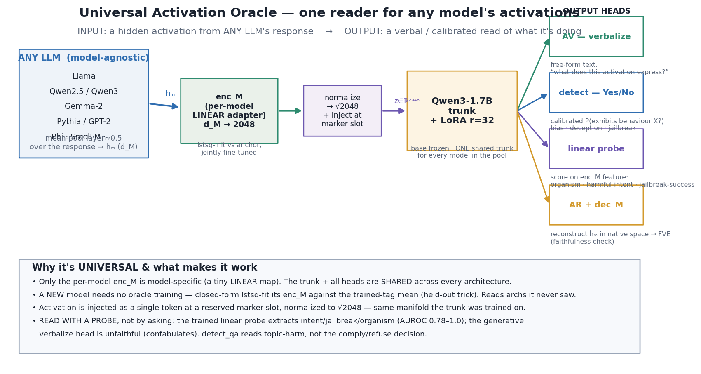
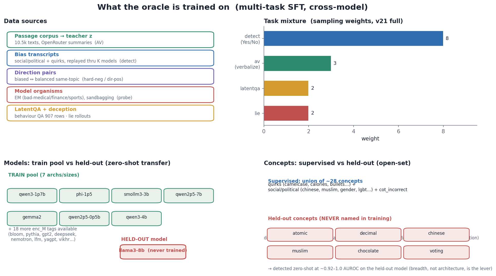
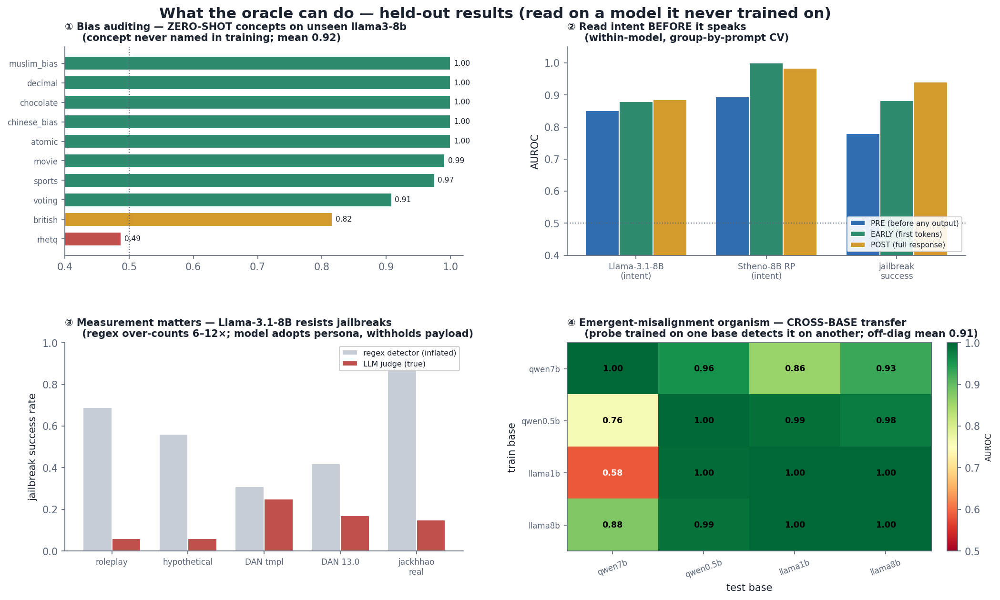

# Figures — Universal Activation Oracle

Generated by `make_figures.py` (matplotlib; real numbers from `../ours_homefield/*.json`,
`../results/*.json`, and `../EXPERIMENTS.md`). Regenerate: `python make_figures.py`.

## 1. Architecture & I/O — *what it is*

**Input** = a mean-pooled hidden activation `hₘ` from *any* LLM's response. A per-model **linear**
`enc_M` maps `d_M → 2048`; the vector is normalized to √2048 and injected at a reserved marker slot
into a **single shared** Qwen3-1.7B + LoRA trunk. Four **output heads**: AV (verbalize → text),
detect (calibrated Yes/No), linear probe (organism / intent / jailbreak score), AR+dec_M (reconstruct
→ FVE). Only `enc_M` is model-specific — everything downstream is shared, so a new architecture needs
no oracle training (closed-form lstsq-fit its `enc_M`).

## 2. Training — *what we train on*

Multi-task SFT, cross-model: data = passage-corpus teacher-z (AV) + bias transcripts (detect) +
direction pairs (hard-neg/dir-pos) + model organisms + LatentQA/deception. Mixture
`detect : av : latentqa : lie`, detect sub-mix ≈ `pos : in-org : clean : hard-neg = 2 : 1.5 : 1.5`
(≈60% negatives → kills confabulation). Trained on a 7-arch pool; **`llama3-8b` held out**;
~6 concepts held out (never named) to test open-set zero-shot.

## 3. Capabilities — *what we can do* (all on the **held-out** model)

① **Bias auditing** — zero-shot concepts on unseen `llama3-8b`, mean AUROC 0.92.
② **Pre-emptive intent** — reads "about to comply with harm" *before output* (PRE 0.85–0.89, EARLY ~1.0).
③ **Measurement matters** — Llama-3.1-8B actually resists jailbreaks; a regex detector over-counts
success 6–12× vs an LLM judge.
④ **Organism transfer** — an emergent-misalignment probe trained on one base detects it on another
(off-diagonal mean 0.91).

**Bottom line:** read activations with a *trained probe* (works, universal, pre-output); the generative
verbalize head confabulates; confounds & label quality decide the numbers.
